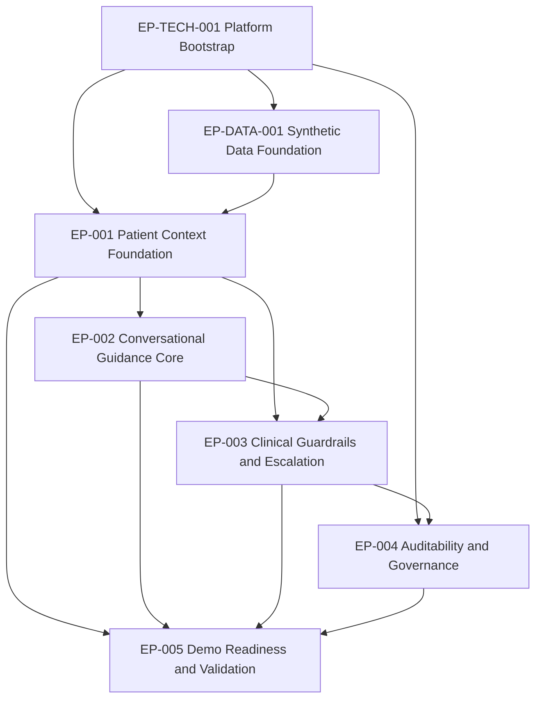

# Patient AI Health Navigator - Epic Backlog

## 1. Objective

This epic backlog decomposes the approved requirements in `.propel/context/docs/spec.md` into actionable delivery streams with clear business value, traceability, and implementation sequencing.

## 2. Prioritization Framework

- Method: MoSCoW with safety-first tie-breaker.
- Primary sort order:
  1. Patient safety impact
  2. Demo criticality
  3. Dependency unblock value
  4. Delivery effort and risk

## 3. Epic Summary

| Epic ID | Epic Name | Priority | Business Value | Primary Outcome |
| --- | --- | --- | --- | --- |
| EP-TECH-001 | Platform and Delivery Bootstrap | Must | High | Stable execution baseline for UI/API, testing, and CI quality gates |
| EP-DATA-001 | Synthetic Data Foundation | Must | High | Reliable patient profile ingestion and normalized context store |
| EP-001 | Patient Context Foundation | Must | Very High | Correct patient selection and profile-grounded responses |
| EP-002 | Conversational Guidance Core | Must | High | High-quality in-scope patient guidance across core question types |
| EP-003 | Clinical Guardrails and Escalation | Must | Critical | Deterministic safety boundaries with guaranteed escalation behavior |
| EP-004 | Auditability and Governance | Must | Very High | Full interaction traceability and guardrail event observability |
| EP-005 | Demo Readiness and Validation | Should | High | Judge-ready walkthrough with measurable success against scoring criteria |

## 4. Detailed Epic Definitions

### EP-TECH-001: Platform and Delivery Bootstrap

- Epic type: Technical Foundation
- Source: [SOURCE:INFERRED]
- Business value:
  - Reduces delivery friction and regression risk across all feature epics.
  - Enables fast iteration with confidence during the 2 to 3 week build window.
- In scope:
  - Next.js application shell and API route structure.
  - Environment configuration, secrets handling, and runtime profiles.
  - Baseline test harness (unit, integration, and e2e scaffolding).
  - Logging schema contracts and shared utility libraries.
- Out of scope:
  - Feature-specific conversation logic.
  - Domain-specific guardrail rules and clinical data mapping details.
- Requirement mapping:
  - NFR-003, NFR-009, NFR-010
  - TR-002, TR-006
- Dependencies:
  - None
- Exit criteria:
  - Application and API run in local environment.
  - Test pipeline can execute sample tests successfully.
  - Shared logging utilities available to downstream epics.

### EP-DATA-001: Synthetic Data Foundation

- Epic type: Data Foundation
- Source: [SOURCE:INFERRED]
- Business value:
  - Enables personalization accuracy and safety by grounding responses in known synthetic clinical records.
- In scope:
  - Synthea data ingestion and normalization pipeline.
  - Patient profile schema for conditions, meds, care plans, encounters, observations, and SDOH flags.
  - Data lineage markers and profile versioning support.
- Out of scope:
  - Live EHR integration and PHI handling.
- Requirement mapping:
  - DR-001, DR-002, DR-003, DR-004, DR-005
  - TR-003, TR-005
- Dependencies:
  - EP-TECH-001
- Exit criteria:
  - At least 5 to 10 showcase profiles loaded and queryable.
  - Profile fields required by FR-002 and FR-003 populated and validated.

### EP-001: Patient Context Foundation

- Epic type: Product Core
- Source: [SOURCE:INPUT]
- Business value:
  - Delivers the core user promise that responses are personalized to the selected patient.
- In scope:
  - Patient selector and profile summary panel.
  - Context injection into conversation requests.
  - Session initialization and patient-context binding.
- Out of scope:
  - Complex question-answering and guardrail escalation logic.
- Requirement mapping:
  - FR-001, FR-002, FR-003
  - UXR-001
- Dependencies:
  - EP-TECH-001, EP-DATA-001
- Exit criteria:
  - User can select patient and begin conversation with loaded profile.
  - Context payload reflects selected patient data with no cross-session leakage.

### EP-002: Conversational Guidance Core

- Epic type: Product Core
- Source: [SOURCE:INPUT]
- Business value:
  - Improves comprehension, adherence, and engagement through natural, contextual conversation.
- In scope:
  - Medication, condition, care plan, appointment, and lifestyle question handling.
  - Multi-turn context handling across 5 to 10 turns.
  - Readability adaptation and clarification prompts.
- Out of scope:
  - Emergency escalation logic and prohibited clinical advice handling.
- Requirement mapping:
  - FR-004, FR-005, FR-006, FR-007, FR-008
  - NFR-005, NFR-006
  - UXR-002, UXR-005
- Dependencies:
  - EP-001, EP-DATA-001
- Exit criteria:
  - Core question categories return grounded responses.
  - Follow-up references are resolved correctly without context resets.

### EP-003: Clinical Guardrails and Escalation

- Epic type: Safety Critical
- Source: [SOURCE:INPUT]
- Business value:
  - Prevents unsafe outputs and ensures clear escalation for high-risk scenarios.
- In scope:
  - Deterministic emergency trigger detection.
  - Off-scope and medication boundary enforcement.
  - Guardrail pre-check and post-check orchestration.
  - Standardized escalation and boundary templates.
- Out of scope:
  - Non-critical UX refinements unrelated to safety.
- Requirement mapping:
  - FR-009, FR-010, FR-011, FR-012, FR-013, FR-014
  - NFR-001
  - AIR-001, AIR-002, AIR-003, AIR-004, AIR-005, AIR-006
  - TR-001, TR-004, TR-007
- Dependencies:
  - EP-001, EP-002
- Exit criteria:
  - Emergency and boundary scenarios pass deterministic checks.
  - No prohibited output escapes when guardrail triggers are present.

### EP-004: Auditability and Governance

- Epic type: Compliance and Observability
- Source: [SOURCE:INPUT]
- Business value:
  - Enables quality review, incident analysis, and trust with clinical stakeholders.
- In scope:
  - Conversation turn logging with timestamp and conversation ID.
  - Guardrail event logging with rule ID and trigger reason.
  - Structured audit schema in MySQL.
  - Field-level encryption for sensitive log content.
- Out of scope:
  - Enterprise SIEM integration or external governance tooling.
- Requirement mapping:
  - FR-015, FR-016
  - NFR-004, NFR-009
  - TR-006
- Dependencies:
  - EP-TECH-001, EP-003
- Exit criteria:
  - Every turn and guardrail event is persisted and queryable.
  - Log schema supports required demo and review evidence.

### EP-005: Demo Readiness and Validation

- Epic type: Validation and Go-Live Readiness
- Source: [SOURCE:INPUT]
- Business value:
  - Converts technical capability into a compelling, judge-ready business story.
- In scope:
  - Mandatory demo scenarios: emergency, off-scope, medication boundary.
  - Personalization verification checks.
  - Quality gate reporting against safety, coherence, and appropriateness targets.
  - Demo script and fallback handling.
- Out of scope:
  - Post-hackathon production hardening tasks.
- Requirement mapping:
  - FR-017, FR-018
  - SM-001, SM-002, SM-003, SM-004, SM-005
  - QG-001, QG-002, QG-003, QG-004
- Dependencies:
  - EP-001, EP-002, EP-003, EP-004
- Exit criteria:
  - End-to-end demo runs consistently with measurable pass evidence.
  - Required scenarios execute in a 3 to 5 minute narrative flow.

## 5. Dependency and Delivery Sequence

## 6. Release Wave Plan

| Wave | Included Epics | Target Outcome |
| --- | --- | --- |
| Wave 1 - Foundations | EP-TECH-001, EP-DATA-001, EP-001 | Patient selection and context loading fully operational |
| Wave 2 - Core Safety | EP-002, EP-003 | In-scope conversation plus deterministic safety enforcement |
| Wave 3 - Trust and Demo | EP-004, EP-005 | Audit evidence, quality gates, and final demo readiness |

## 7. Risk Hotspots by Epic

| Epic ID | Primary Risk | Mitigation |
| --- | --- | --- |
| EP-DATA-001 | Data normalization mismatch causing wrong context | Contract tests for profile schema and deterministic mapping rules |
| EP-003 | Missed emergency trigger or boundary bypass | Adversarial guardrail test suite and fail-closed response policy |
| EP-004 | Incomplete logs or missing guardrail metadata | Required audit fields with write-time validation |
| EP-005 | Demo fragility under time pressure | Scripted runs, backup scenarios, and pre-demo checklist |

## 8. Traceability Coverage Check

- Covered requirement classes: FR, NFR, TR, DR, AIR, UXR, SM, QG.
- Critical safety requirements mapped: FR-009 to FR-014 and AIR-001 to AIR-006.
- Business value alignment maintained through explicit outcome per epic.
