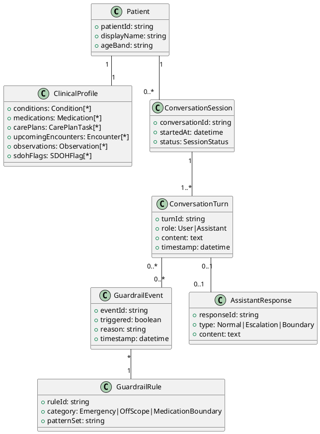
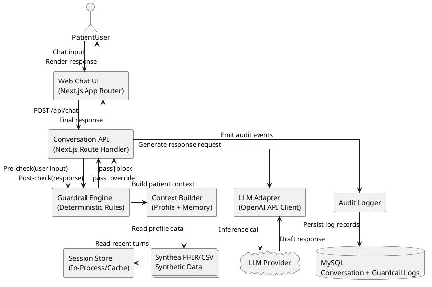
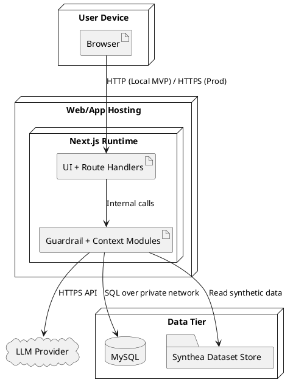
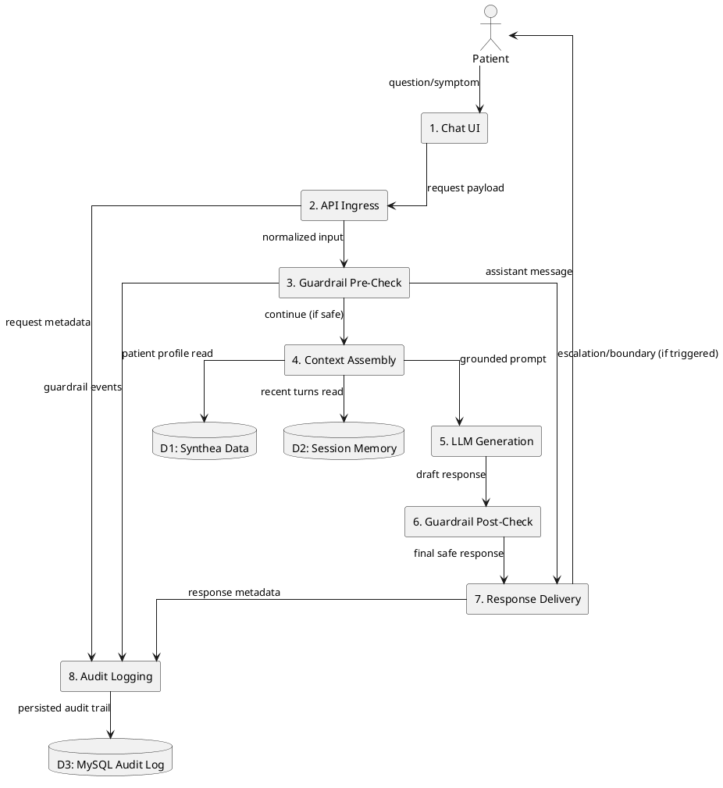
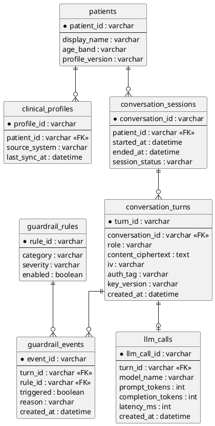
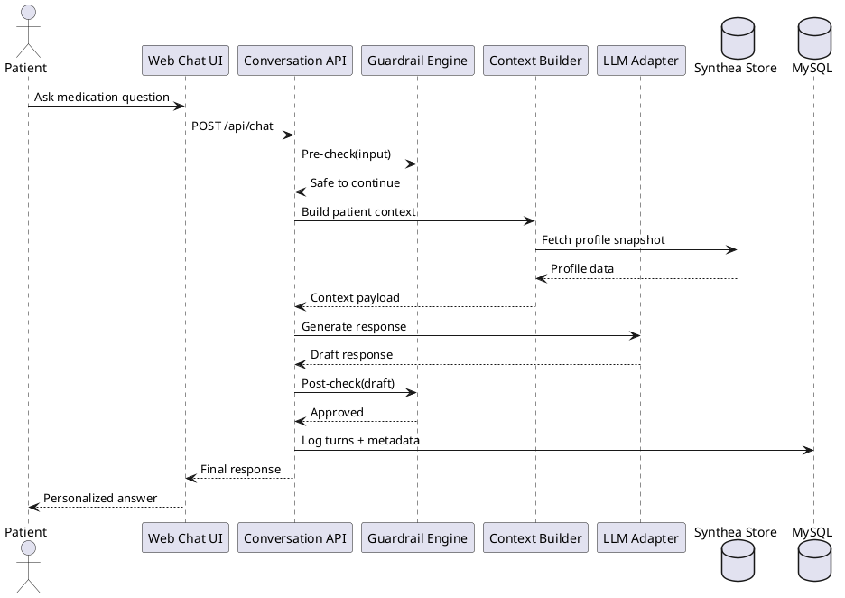
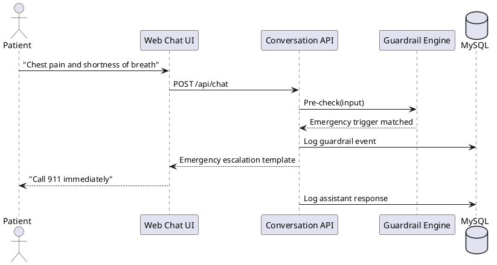
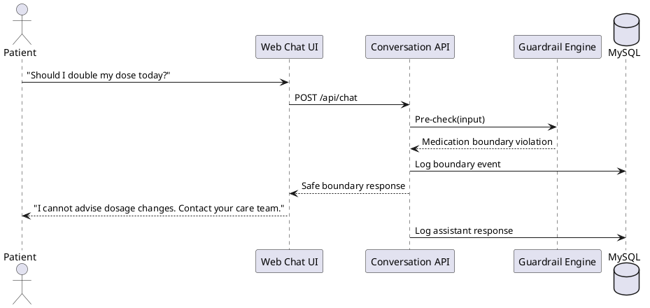

# Patient AI Health Navigator - UML Model Document

## 1. Purpose

This document translates the approved requirements in `.propel/context/docs/spec.md` into visual architecture and interaction models for implementation, testing, and review.

## 2. Scope and Modeling Assumptions

- Scope is limited to MVP behavior defined in the specification.
- Synthetic patient data from Synthea is the only clinical data source.
- Local demo deployment may use HTTP; production deployment must use HTTPS/TLS.
- The system is non-diagnostic and must enforce deterministic guardrails.

## 3. Conceptual Model (Domain View)

## 4. Component Diagram (Logical Architecture)

## 5. Deployment Diagram (Environment View)

## 6. Data Flow Diagram (Runtime Pipeline)

## 7. Entity Relationship Diagram (Persistence Model)

## 8. Sequence Diagram - Standard In-Scope Conversation

## 9. Sequence Diagram - Emergency Escalation Path

## 10. Sequence Diagram - Off-Scope Boundary Path

## 11. Model-to-Requirement Traceability

| Model View | Primary Coverage |
| --- | --- |
| Conceptual Model | FR-001 to FR-008, FR-015, FR-016, DR-003 |
| Component Diagram | TR-001 to TR-007, FR-009 to FR-014 |
| Deployment Diagram | NFR-003, NFR-004, NFR-010, constraints in Section 5 |
| Data Flow Diagram | FR-003, FR-008 to FR-016, AIR-001 to AIR-006 |
| ERD | FR-015, FR-016, TR-006, NFR-004 |
| Sequence (In-Scope) | FR-004 to FR-008, FR-015 |
| Sequence (Emergency) | FR-009, FR-010, FR-016, AIR-004 |
| Sequence (Off-Scope) | FR-011 to FR-014, AIR-002, AIR-005 |

## 12. Open Implementation Notes

- For local MVP speed, the same Next.js app hosts UI and backend API routes.
- For production hardening, separate API service deployment and enforce HTTPS/TLS only.
- Sensitive log fields should remain encrypted at rest with key version metadata.
