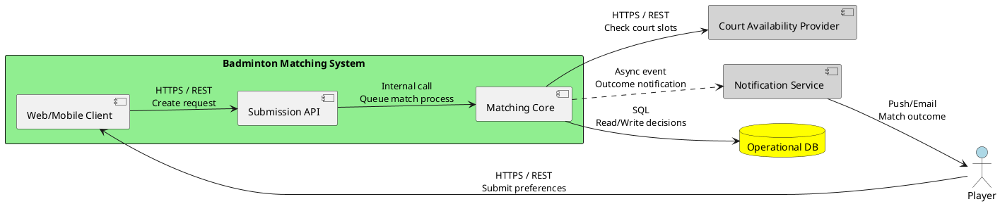
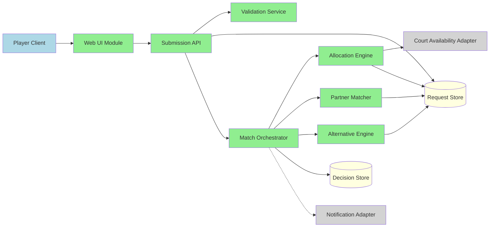
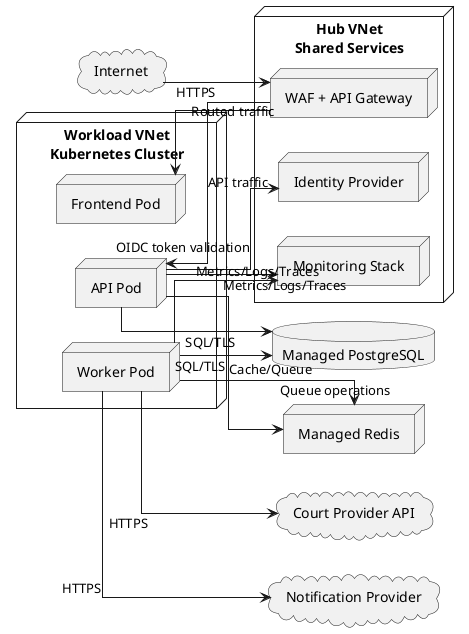
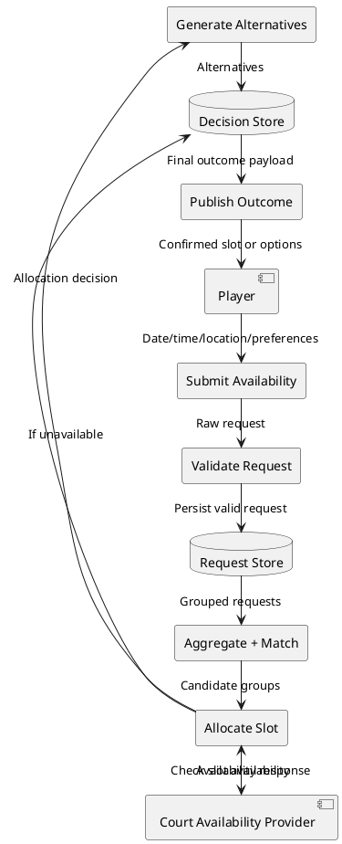
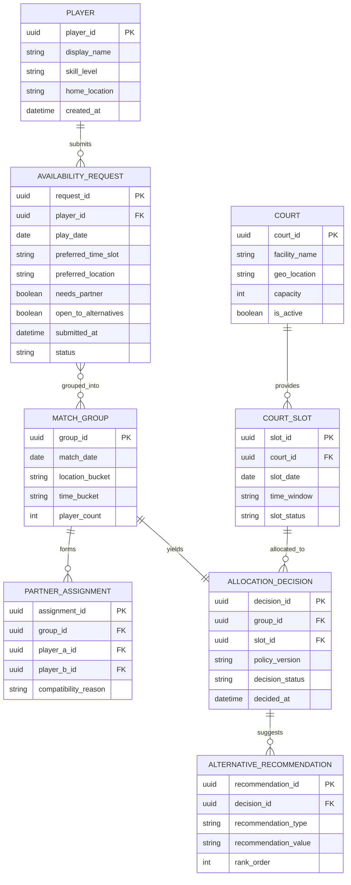
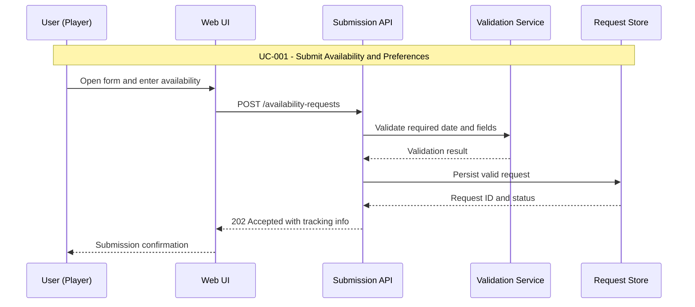
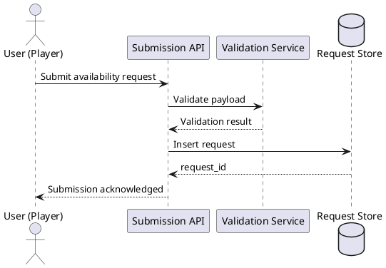
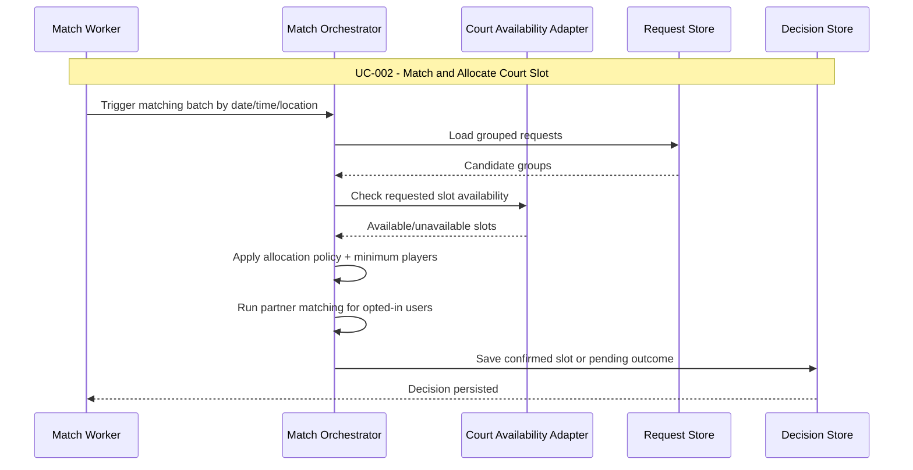
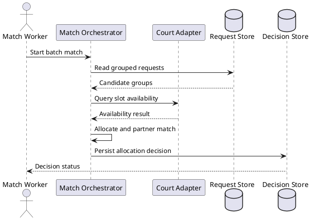
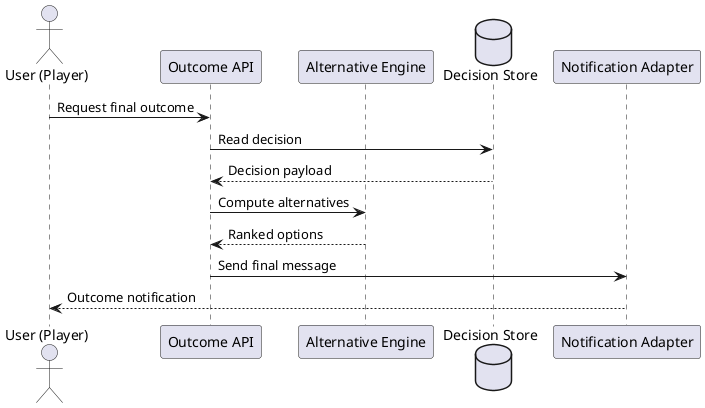

# Design Modelling

## UML Models Overview
This document translates requirements in `.propel/context/docs/spec.md` and
architecture decisions in `.propel/context/docs/design.md` into executable text
models. It provides system boundary, component, deployment, data flow, data
structure, and per-use-case runtime interaction views to support implementation,
review, and onboarding.

## Architectural Views

### System Context Diagram


### Component Architecture Diagram


### Deployment Architecture Diagram


### Data Flow Diagram


### Logical Data Model (ERD)


### Use Case Sequence Diagrams

#### UC-001: Submit Availability and Preferences
**Source**: [spec.md#UC-001](.propel/context/docs/spec.md#UC-001)





#### UC-002: Match and Allocate Court Slot
**Source**: [spec.md#UC-002](.propel/context/docs/spec.md#UC-002)





#### UC-003: Provide Alternatives and Final Outcome
**Source**: [spec.md#UC-003](.propel/context/docs/spec.md#UC-003)

```mermaid
sequenceDiagram
    participant Player as User (Player)
    participant API as Outcome API
    participant Alt as Alternative Engine
    participant Repo as Decision Store
    participant Notify as Notification Adapter

    Note over Player,Notify: UC-003 - Provide Alternatives and Final Outcome

    Player->>API: Request match result
    API->>Repo: Fetch allocation decision
    Repo-->>API: Primary outcome
    API->>Alt: Generate alternatives if unavailable and allowed
    Alt-->>API: Ranked alternatives
    API->>Notify: Publish final outcome message
    Notify-->>Player: Confirmed slot or alternatives
```


