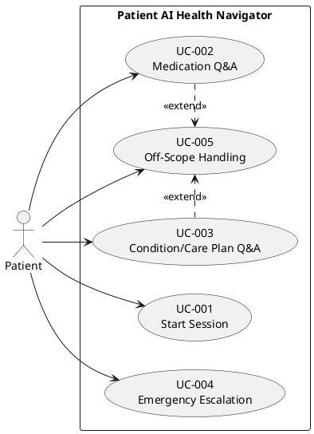
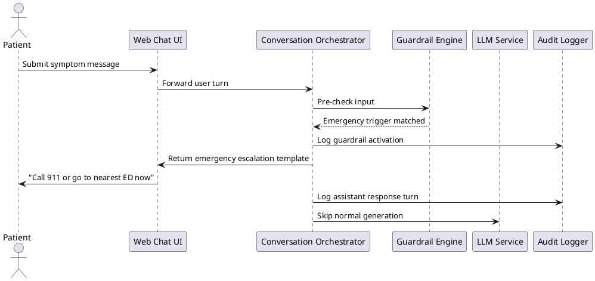

# Patient AI Health Navigator - Functional Specification

## 1. Executive Summary

The Patient AI Health Navigator is a conversational assistant that helps patients understand their existing care instructions between clinical visits. The system uses synthetic patient records from Synthea to provide personalized guidance for medications, conditions, care plans, appointments, and symptom-related next steps.

The solution is explicitly non-diagnostic. Deterministic safety guardrails override language model output whenever emergency or out-of-scope scenarios are detected. The product objective is to reduce avoidable utilization drivers such as medication non-adherence, missed appointments, and inappropriate emergency department use while improving patient comprehension and confidence.

## 2. Business Context and Objectives

### 2.1 Problem Context

- Estimated avoidable utilization burden: $150B per year in the US.
- Medication non-adherence in chronic disease populations is approximately 50%.
- No-show rates commonly range from 18% to 23%.
- 13% to 27% of ED visits may be manageable in lower-acuity settings.
- 36% of US adults have basic or below-basic health literacy.

### 2.2 Business Objectives

- OBJ-001: Improve post-visit patient engagement through always-available conversational guidance.
- OBJ-002: Improve understanding of medication and care plan adherence steps.
- OBJ-003: Reduce preventable care escalation through clear emergency and non-emergency routing guidance.
- OBJ-004: Demonstrate governance readiness with complete auditability of every conversation turn.

### 2.3 Success Metrics

- SM-001: Guardrail trigger compliance = 100% on defined emergency and scope boundary scenarios.
- SM-002: Personalization accuracy = 100% for patient-specific facts referenced in responses.
- SM-003: Clinical appropriateness score >= 90% in domain review.
- SM-004: Multi-turn coherence maintained across at least 5 to 10 turns without context loss.
- SM-005: Default content readability aligned to grade 6 to 8 language unless user asks for advanced detail.

## 3. Scope

### 3.1 In Scope

- Web chat interface for synthetic patients.
- Patient profile loading from Synthea records.
- Personalized response generation grounded in patient context.
- Deterministic clinical guardrails and escalation messaging.
- Multi-turn context retention during session.
- Conversation turn audit logging with guardrail flags.

### 3.2 Out of Scope

- Voice interaction.
- Live EHR integration or patient portal integration.
- Real patient PHI ingestion or processing.
- Clinical diagnosis, triage judgment, or treatment recommendation.
- Medication dosage adjustments, medication stop/start directives, or drug interaction decision support.
- Mobile app and SMS channels for MVP.
- Multilingual support for MVP.

## 4. Stakeholders and Users

- Primary users: Patients interacting with the navigator.
- Clinical governance stakeholders: Clinical domain reviewers validating safety and appropriateness.
- Operational stakeholders: Provider engagement and patient experience leaders.
- Technical stakeholders: Product, engineering, QA, and data engineering teams.

## 5. Assumptions and Constraints

- Synthetic data source: Synthea FHIR R4 and supporting exports.
- MVP timeline: 2 to 3 week build sprint.
- English-only interaction for MVP.
- Guardrails execute independently and have higher priority than model output.
- Provider contact routing details are configured for demo profiles.
- Local demo transport may use HTTP for speed of setup; production deployment must enforce HTTPS/TLS.

## 6. Functional Requirements

- FR-001 [SOURCE:INPUT]: The system MUST allow selection of a preloaded synthetic patient profile before chat begins.
- FR-002 [SOURCE:INPUT]: The system MUST load and display patient summary details including active conditions, current medications, care plan tasks, upcoming appointments, and recent observations.
- FR-003 [SOURCE:INPUT]: The system MUST inject patient context into each response generation request.
- FR-004 [SOURCE:INPUT]: The system MUST answer medication questions using the selected patient data when relevant.
- FR-005 [SOURCE:INPUT]: The system MUST answer condition explanation questions in plain language and connect explanations to the selected patient profile when relevant.
- FR-006 [SOURCE:INPUT]: The system MUST answer appointment and care plan guidance questions using current schedule and care plan tasks for the selected patient.
- FR-007 [SOURCE:INPUT]: The system MUST answer diet and lifestyle questions using patient context and approved educational guidance.
- FR-008 [SOURCE:INPUT]: The system MUST maintain multi-turn context for at least 5 to 10 exchanges in a single conversation session.
- FR-009 [SOURCE:INPUT]: The system MUST detect emergency symptom triggers using deterministic keyword and phrase rules.
- FR-010 [SOURCE:INPUT]: The system MUST immediately override model output and return emergency escalation guidance when emergency triggers are detected.
- FR-011 [SOURCE:INPUT]: The system MUST refuse diagnosis requests and return scope boundary messaging.
- FR-012 [SOURCE:INPUT]: The system MUST refuse requests to stop medication, change dose, or provide dose recommendation and return safe boundary messaging.
- FR-013 [SOURCE:INPUT]: The system MUST refuse clinical interpretation of labs as dangerous or normal and return safe boundary messaging.
- FR-014 [SOURCE:INPUT]: The system MUST provide provider contact escalation messaging for non-emergency out-of-scope clinical requests.
- FR-015 [SOURCE:INPUT]: The system MUST log each user and assistant turn with timestamp and conversation identifier.
- FR-016 [SOURCE:INPUT]: The system MUST flag and log every guardrail activation including rule identifier and activation reason.
- FR-017 [SOURCE:INPUT]: The system MUST support demonstration scenarios for emergency escalation, off-scope handling, and medication safety boundary.
- FR-018 [SOURCE:INFERRED]: The system MUST display a persistent disclaimer that it does not diagnose, prescribe, or replace clinician advice.

## 7. Non-Functional Requirements

- NFR-001 [SOURCE:INPUT]: Safety-critical guardrail routing MUST execute deterministically before assistant response is shown.
- NFR-002 [SOURCE:INPUT]: Personalization accuracy for patient facts MUST be 100% against selected Synthea record during evaluation scenarios.
- NFR-003 [SOURCE:INPUT]: The system SHOULD return a first response within 3 seconds under normal demo load.
- NFR-004 [SOURCE:INPUT]: The system MUST maintain complete audit logs for all turns and guardrail events.
- NFR-005 [SOURCE:INPUT]: The system MUST provide readable language targeted to grade 6 to 8 by default.
- NFR-006 [SOURCE:INPUT]: The system MUST preserve session context consistency across 5 to 10 turns.
- NFR-007 [SOURCE:INFERRED]: The system MUST be configurable to run with synthetic data only for non-production use.
- NFR-008 [SOURCE:INFERRED]: The system MUST prevent disclosure of hidden system prompts and internal safety rules in user-facing output.
- NFR-009 [SOURCE:INFERRED]: The system SHOULD provide structured logs suitable for post-demo quality review.
- NFR-010 [SOURCE:INFERRED]: The UI MUST remain usable on common desktop and laptop resolutions used during live demo.

## 8. Technical Requirements

- TR-001 [SOURCE:INPUT]: Implement a guardrail engine independent from LLM output generation.
- TR-002 [SOURCE:INPUT]: Implement conversation orchestrator with ordered flow: input -> guardrail pre-check -> context assembly -> model call -> guardrail post-check -> output.
- TR-003 [SOURCE:INPUT]: Support patient profile extraction pipeline from Synthea resources: Patient, Condition, MedicationRequest, CarePlan, Encounter, Observation.
- TR-004 [SOURCE:INPUT]: Provide configurable emergency phrase library including chest pain, shortness of breath, stroke indicators, suicidal ideation, severe allergic reaction, and severe distress statements.
- TR-005 [SOURCE:INFERRED]: Use normalized internal schema for active medications including name, dose text, schedule text, and status.
- TR-006 [SOURCE:INFERRED]: Emit structured audit events in JSON lines or equivalent format.
- TR-007 [SOURCE:INFERRED]: Provide deterministic test harness for at least three required guardrail scenarios.

## 9. Data Requirements

- DR-001 [SOURCE:INPUT]: Use Synthea synthetic datasets only for MVP.
- DR-002 [SOURCE:INPUT]: Generate or load at least 5 to 10 showcase patients with diverse clinical profiles.
- DR-003 [SOURCE:INPUT]: Maintain patient context attributes: active conditions, medications with dosages, care plan tasks, upcoming encounters, recent observations, and SDOH flags.
- DR-004 [SOURCE:INPUT]: Preserve terminology codes when available (SNOMED CT, LOINC, RxNorm, ICD-10-CM, CPT/HCPCS, CVX, NDC).
- DR-005 [SOURCE:INFERRED]: Maintain data lineage from source record to response citations for evaluation and debugging.

## 10. AI and Safety Requirements

- AIR-001 [SOURCE:INPUT]: The assistant MUST not diagnose conditions.
- AIR-002 [SOURCE:INPUT]: The assistant MUST not recommend medication dose changes or discontinuation.
- AIR-003 [SOURCE:INPUT]: The assistant MUST not provide clinical judgment interpretation of lab values.
- AIR-004 [SOURCE:INPUT]: Emergency trigger activation MUST return immediate emergency instruction without risk-minimizing language.
- AIR-005 [SOURCE:INPUT]: Out-of-scope clinical requests MUST return clear handoff to care team and emergency fallback guidance.
- AIR-006 [SOURCE:INFERRED]: Guardrail responses MUST be templatized and versioned to ensure deterministic behavior.

## 11. UX Requirements

- UXR-001 [SOURCE:INPUT]: The chat interface MUST show selected patient summary alongside conversation panel for transparency.
- UXR-002 [SOURCE:INPUT]: Responses MUST avoid unnecessary jargon and offer clarification prompts such as asking whether the patient wants terms explained.
- UXR-003 [SOURCE:INPUT]: Escalation responses MUST be visually distinct from regular responses.
- UXR-004 [SOURCE:INFERRED]: The interface MUST indicate that emergency concerns require immediate real-world action and must not imply in-app resolution.
- UXR-005 [SOURCE:INFERRED]: Chat interaction should preserve clear turn separation and timestamps for user trust and audit readability.

## 12. Use Cases

### UC-001: Start Session and Load Patient Context

- Primary actor: Patient user
- Supporting actor: System
- Trigger: User opens navigator and selects a patient profile
- Preconditions:
  - Synthetic patient dataset is loaded and available
  - At least one patient profile is selectable
- Main flow:
  1. User opens the web chat interface.
  2. System prompts patient profile selection.
  3. User selects a showcase patient.
  4. System loads patient summary and confirms readiness.
  5. User starts conversation.
- Alternate flows:
  - A1: If profile load fails, system shows retry guidance and blocks chat until context loads.
- Postconditions:
  - Active session has selected patient context.
- Requirements mapped: FR-001, FR-002, FR-003

### UC-002: Ask Personalized Medication Question

- Primary actor: Patient user
- Trigger: User asks about medications, timing, or missed dose context
- Preconditions:
  - Active patient session exists
- Main flow:
  1. User asks a medication question.
  2. System checks guardrails.
  3. System generates context-grounded response using patient medication list.
  4. System returns plain-language answer and optional clarification prompt.
  5. System logs turn pair.
- Alternate flows:
  - A1: If question requests dosage change, guardrail boundary response is returned.
- Postconditions:
  - User receives safe, contextual medication education.
- Requirements mapped: FR-004, FR-008, FR-012, FR-015, FR-016

### UC-003: Ask Condition or Care Plan Question

- Primary actor: Patient user
- Trigger: User asks condition explanation or care plan follow-up
- Preconditions:
  - Active patient session exists
- Main flow:
  1. User asks condition or care plan question.
  2. System checks guardrails.
  3. System answers in plain language linked to patient profile.
  4. System asks whether user wants further explanation.
  5. System logs turn pair.
- Alternate flows:
  - A1: If user asks for diagnosis confirmation, scope boundary response is returned.
- Postconditions:
  - User receives contextual understanding support.
- Requirements mapped: FR-005, FR-006, FR-008, FR-011, FR-015

### UC-004: Emergency Symptom Escalation

- Primary actor: Patient user
- Trigger: User message contains emergency trigger indicators
- Preconditions:
  - Active conversation session
- Main flow:
  1. User reports severe symptom (for example chest pain with shortness of breath).
  2. Guardrail engine detects emergency trigger.
  3. System suppresses normal model response.
  4. System returns immediate emergency escalation instruction.
  5. System logs guardrail activation and response.
- Alternate flows:
  - A1: If multiple emergency triggers are present, system still returns one clear emergency instruction.
- Postconditions:
  - User is directed to emergency care immediately.
- Requirements mapped: FR-009, FR-010, FR-015, FR-016

### UC-005: Off-Scope Clinical Request Handling

- Primary actor: Patient user
- Trigger: User asks for diagnosis, treatment decision, or lab judgment
- Preconditions:
  - Active conversation session
- Main flow:
  1. User submits off-scope clinical request.
  2. Guardrail engine classifies request as out of scope.
  3. System returns boundary response and care team escalation contact path.
  4. System logs boundary trigger.
- Alternate flows:
  - A1: If user insists repeatedly, system repeats safe boundary messaging without producing prohibited advice.
- Postconditions:
  - Unsafe guidance is prevented.
- Requirements mapped: FR-011, FR-012, FR-013, FR-014, FR-016

## 13. Use Case Diagram (PlantUML)

## 14. Sequence Diagram - Emergency Escalation (PlantUML)

## 15. Epic Decomposition and Requirement Mapping

| Epic ID | Epic Name | Description | Requirement Mapping | Priority |
| --- | --- | --- | --- | --- |
| EP-001 | Patient Context Foundation | Build profile loader, context normalization, and patient summary presentation | FR-001, FR-002, FR-003, DR-001, DR-002, DR-003, TR-003 | Must |
| EP-002 | Conversational Guidance Core | Build personalized chat flows for medications, conditions, appointments, and lifestyle guidance | FR-004, FR-005, FR-006, FR-007, FR-008, UXR-002 | Must |
| EP-003 | Clinical Guardrails and Escalation | Implement deterministic safety boundaries, emergency escalation, and off-scope handling | FR-009, FR-010, FR-011, FR-012, FR-013, FR-014, AIR-001 to AIR-006, TR-001, TR-004 | Must |
| EP-004 | Auditability and Governance | Implement complete turn logging, guardrail event logs, and review-ready telemetry | FR-015, FR-016, NFR-004, NFR-009, TR-006 | Must |
| EP-005 | Demo Readiness and Validation | Build mandatory scenarios, quality checks, and consistency benchmarks | FR-017, FR-018, NFR-001, NFR-002, NFR-005, NFR-006, TR-007 | Should |

## 16. Technical Architecture Considerations

### 16.1 Primary Architecture Choice: Guardrail-First Monolithic Service

- Rationale:
  - Fastest to implement within 2 to 3 week hackathon window.
  - Deterministic guardrail ordering is simple to enforce in a single orchestration service.
  - Minimizes integration complexity while preserving auditability.
- Key components:
  - Web chat frontend
  - Conversation orchestrator API
  - Guardrail engine
  - Patient context service
  - LLM adapter
  - Audit logging sink

### 16.2 Secondary Architecture Choice: Event-Driven Safety Pipeline

- Rationale:
  - Better long-term scaling and observability.
  - Supports asynchronous quality review streams and policy versioning.
- Tradeoff:
  - Higher implementation overhead and testing complexity for hackathon phase.

## 17. Validation and Acceptance Criteria

### 17.1 Functional Acceptance

- AC-001: Profile selection and summary load work for all showcase patients.
- AC-002: Medication and condition responses correctly reference selected patient data.
- AC-003: At least one conversation demonstrates coherent context handling across 5 to 10 turns.
- AC-004: Emergency trigger scenario always returns immediate escalation text without model-generated triage.
- AC-005: Off-scope and medication safety boundaries consistently refuse prohibited advice.
- AC-006: Complete conversation and guardrail events are present in logs with timestamps.

### 17.2 Quality Gates

- QG-001: Guardrail compliance: 100% on required safety test scenarios.
- QG-002: Personalization correctness: 100% for evaluated patient fact references.
- QG-003: Clinical appropriateness: >= 90% reviewer score.
- QG-004: Readability: majority responses within grade 6 to 8 unless user requests advanced language.

## 18. Risks and Mitigations

| Risk ID | Risk | Impact | Mitigation |
| --- | --- | --- | --- |
| RK-001 | False negative guardrail detection | Critical patient safety failure | Expand deterministic trigger library, add adversarial scenario tests, treat misses as release blockers |
| RK-002 | Hallucinated patient facts | Unsafe misinformation | Strict context-grounding checks, response post-validation against loaded profile |
| RK-003 | Poor readability for low literacy users | Reduced patient comprehension | Enforce plain-language response rubric and review scoring |
| RK-004 | Logging gaps | Governance and traceability failure | Centralized structured logging with mandatory fields and integration tests |

## 19. Requirement Quality Self-Assessment

| Evaluation Dimension | Score | Notes |
| --- | --- | --- |
| Business Alignment | 96% | Directly maps to stated utilization and engagement problem drivers |
| Requirements Completeness | 94% | Covers FR, NFR, TR, DR, AIR, UXR, UC, epics, quality gates |
| Technical Accuracy | 92% | Architecture and guardrail sequencing are feasible for MVP timeline |
| Clarity and Precision | 93% | Requirements are testable and unambiguous with explicit boundaries |
| Testability | 95% | Acceptance criteria and quality gates map to measurable outcomes |
| Stakeholder Coverage | 90% | Captures patient, clinical governance, and engineering stakeholders |
| Risk Management | 91% | Includes key safety and governance risks with mitigations |

## 20. Traceability Index

| Source Need | Requirements |
| --- | --- |
| Personalized patient guidance using Synthea data | FR-001 to FR-008, DR-001 to DR-005 |
| Deterministic clinical safety boundaries | FR-009 to FR-014, AIR-001 to AIR-006, TR-001, TR-004 |
| Multi-turn memory and conversational coherence | FR-008, NFR-006, UC-002, UC-003 |
| Auditability and governance | FR-015, FR-016, NFR-004, TR-006 |
| Demo proof points and judging criteria | FR-017, SM-001 to SM-005, QG-001 to QG-004 |

## 21. Final Tech Stack

### 21.1 Application Stack

- Frontend: Next.js (App Router) with TypeScript and Tailwind CSS.
- Backend API: Next.js Route Handlers (Node runtime) for orchestration, guardrails, and LLM calls.
- LLM Integration: OpenAI API through server-side adapter layer.
- Session State: Server-managed conversation context per conversation ID.

### 21.2 Data and Storage

- Clinical Source Data: Synthea synthetic records (FHIR R4 JSON, optional CSV normalization).
- Operational Database: MySQL for conversation logs, guardrail events, and audit trails.
- De-identified Analytics: Export pipeline with l-diversity checks for reporting datasets.

### 21.3 Safety, Logging, and Security

- Guardrail Engine: Deterministic pre-check and post-check rule layer in backend API flow.
- Audit Logging: Structured JSON log schema persisted to MySQL.
- Encryption Strategy: Field-level encryption for sensitive log content, with key versioning.
- Transport Strategy (MVP): HTTP allowed for local hackathon demo environment only.
- Transport Strategy (Production): HTTPS/TLS mandatory.

### 21.4 Test and Delivery

- Unit and Integration Testing: Vitest/Jest for guardrails, orchestration, and data services.
- End-to-End Testing: Playwright for chat journeys and escalation scenarios.
- Deployment Pattern: Frontend and API via Next.js hosting platform; managed MySQL service for logs.
