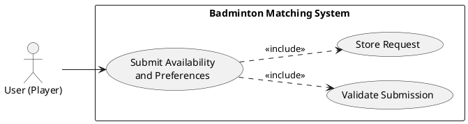
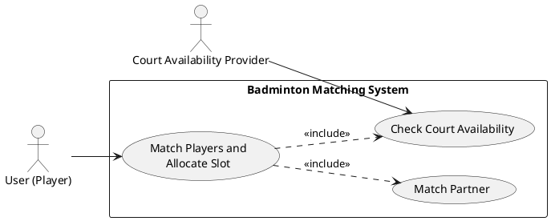
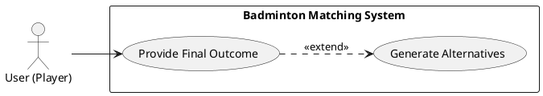

# Requirements Specification

## Feature Goal
Build a badminton session coordination system that captures player availability and preferences, matches players to available court slots and compatible partners, and provides practical alternatives when first-choice options are unavailable.

## Business Justification
- Reduces friction for players who currently struggle to find open slots and compatible partners.
- Centralizes fragmented coordination activity into one workflow for discovery, matching, and booking support.
- Improves court utilization and player satisfaction through faster, near real-time match and slot suggestions.

## Feature Scope
The system accepts player intent (date, optional time/location/skill, partner and alternative preferences), aggregates demand by date/time/location, evaluates court availability and player grouping rules, allocates slots, matches partners when requested, and returns confirmed or alternative options with clear result status.

### Success Criteria
- [ ] At least 95% of valid availability submissions are processed and grouped within 5 seconds.
- [ ] At least 90% of requests for partner matching receive a deterministic match result or an explicit no-match status within 10 seconds.
- [ ] 100% of unfulfilled primary slot requests return at least one alternative recommendation when alternatives exist.
- [ ] Mobile users can complete submission in <= 60 seconds with no required field beyond date.

## Functional Requirements
- FR-001: [DETERMINISTIC] System MUST allow a player to submit badminton interest with mandatory date and optional time slot, location or preferred court, and skill level.
- FR-002: [DETERMINISTIC] System MUST capture and store player preferences for partner needed (Yes or No) and open to alternative slots (Yes or No).
- FR-003: [DETERMINISTIC] System MUST validate mandatory input fields and reject incomplete or invalid submissions with actionable validation messages.
- FR-004: [DETERMINISTIC] System MUST aggregate valid requests by date, time slot, and location to form candidate play groups.
- FR-005: [DETERMINISTIC] System MUST evaluate requested slot availability against court inventory and existing allocations.
- FR-006: [UNCLEAR] System MUST allocate available slots using either first-come-first-serve or configured priority rules, pending business rule finalization.
- FR-007: [DETERMINISTIC] System MUST enforce minimum required player count per court before marking a slot as confirmed.
- FR-008: [DETERMINISTIC] System MUST match partner-seeking players with others sharing the same date and same or nearby location, with optional skill compatibility filtering.
- FR-009: [DETERMINISTIC] System MUST avoid duplicate partner assignment so one player is not assigned to multiple overlapping sessions.
- FR-010: [DETERMINISTIC] System MUST generate alternative recommendations when primary requests are unavailable, including nearby courts, closest time slots, and partially matching groups.
- FR-011: [DETERMINISTIC] System MUST honor player preference for alternatives by suppressing alternative suggestions when the user selects open to alternative slots = No.
- FR-012: [DETERMINISTIC] System MUST return a result payload containing confirmed slot details, partner details when applicable, and alternative options when applicable.
- FR-013: [DETERMINISTIC] System MUST support location-based filtering for all search, matching, and recommendation operations.
- FR-014: [DETERMINISTIC] System MUST execute matching and recommendation in real-time or near real-time to keep results relevant.

## Use Case Analysis

### Actors & System Boundary
- User (Player): Submits interest, preferences, and reviews confirmed or alternative play options.
- Matching and Allocation System: Validates submissions, groups requests, allocates slots, and computes partner or alternative outcomes.
- Court Availability Provider (System Actor): Provides available court inventory by date, time, and location for allocation checks.

### Use Case Specifications
For each goal derive the use case and provide detailed specifications:

#### UC-001: Submit Availability and Preferences
- **Actor(s)**: User (Player)
- **Goal**: Express intent to play badminton with preferred date, optional constraints, and matching preferences.
- **Preconditions**: User can access submission interface; at least one valid date is selectable.
- **Success Scenario**:
  1. Player opens submission form.
  2. Player enters required date and optional time, location, skill level.
  3. Player sets partner and alternative preferences.
  4. System validates and stores request.
  5. System acknowledges submission and queues it for matching.
- **Extensions/Alternatives**:
  - 3a. Player omits optional fields; system accepts partial preference set.
  - 4a. Validation fails (for example, missing date); system returns field-level errors.
- **Postconditions**: Valid request is persisted and included in aggregation batch.

##### Use Case Diagram

#### UC-002: Match and Allocate Court Slot
- **Actor(s)**: Matching and Allocation System
- **Goal**: Form playable groups, match partners when required, and allocate a valid court slot.
- **Preconditions**: At least one valid player request exists for target date; court availability data is accessible.
- **Success Scenario**:
  1. System aggregates requests by date, time slot, and location.
  2. System checks court availability for candidate slots.
  3. System applies allocation policy and minimum player rules.
  4. System matches partner-seeking players with compatible candidates.
  5. System marks slot as confirmed and prepares response payload.
- **Extensions/Alternatives**:
  - 2a. Court inventory unavailable; system retries and marks request pending if retry fails.
  - 4a. No compatible partner found; system proceeds without partner and flags unmet partner preference.
- **Postconditions**: Request is either confirmed with slot details or moved to alternative recommendation flow.

##### Use Case Diagram

#### UC-003: Provide Alternatives and Final Outcome
- **Actor(s)**: User (Player)
- **Goal**: Receive clear confirmation or ranked alternatives when preferred slot is unavailable.
- **Preconditions**: Primary allocation attempt has completed.
- **Success Scenario**:
  1. System determines primary request cannot be fulfilled.
  2. System checks user preference for alternatives.
  3. System computes nearby courts, closest times, and partial group matches.
  4. System returns outcome with alternatives and supporting details.
  5. Player reviews options and chooses next action.
- **Extensions/Alternatives**:
  - 2a. User opted out of alternatives; system returns unavailable status without recommendations.
  - 3a. No alternatives found; system returns explicit no-availability outcome.
- **Postconditions**: User receives final response package with confirmation or best available alternatives.

##### Use Case Diagram

## Risks & Mitigations
- Ambiguous allocation policy (FCFS vs priority) may cause inconsistent outcomes; mitigate by defining one enforceable policy and publishing tie-break rules.
- Incomplete or low-quality user inputs can reduce match quality; mitigate with validation, sensible defaults, and progressive profile enrichment.
- Near real-time expectations may degrade under peak demand; mitigate with queueing, caching of court availability, and horizontal scaling.
- Location proximity thresholds may produce irrelevant alternatives; mitigate with configurable distance radius and telemetry-driven tuning.
- Partner matching fairness concerns (skill mismatch) can lower satisfaction; mitigate with optional skill tolerance settings and feedback loop.

## Constraints & Assumptions
- Court availability data source is accurate and refreshed frequently enough for near real-time decisions.
- Date is mandatory and serves as the minimum key for request aggregation.
- Proximity logic for nearby courts is based on configured geospatial distance threshold.
- Minimum players per court is a configurable business rule and may vary by facility.
- Mobile-first UX is required, but the first release may use responsive web UI before native apps.
